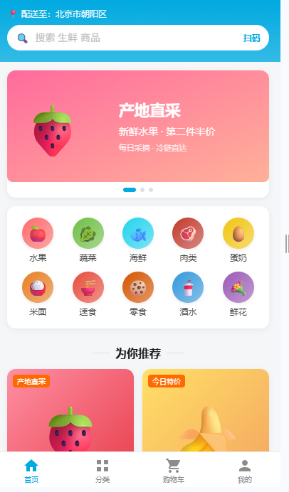
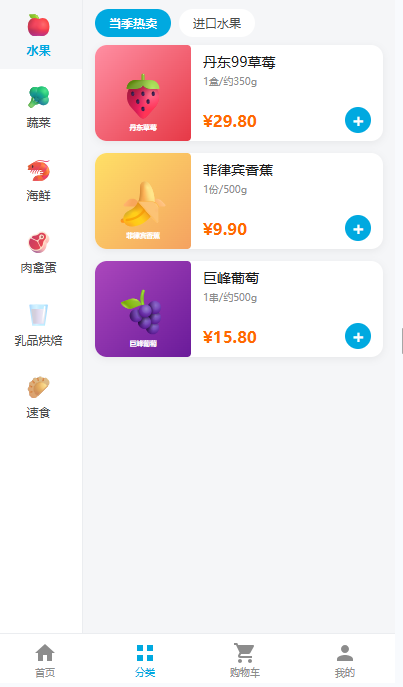
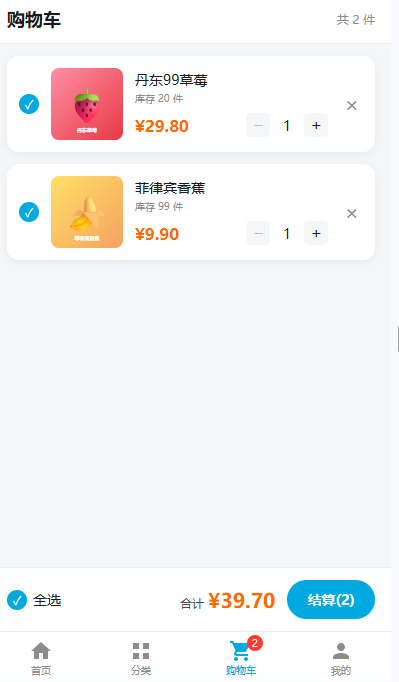
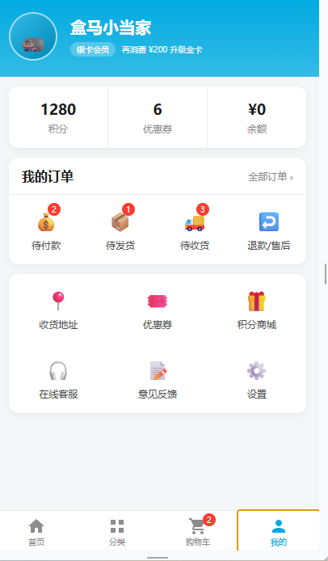

# 盒马生鲜移动端 SPA

> 基于 Vue3 全家桶构建的高保真移动端生鲜商城。

## 技术栈

- **Vue 3** — Composition API / `<script setup>`
- **Vite** — 构建工具与开发服务器
- **Vue Router 4** — 路由管理
- **Pinia** — 状态管理（配合 `pinia-plugin-persistedstate` 持久化）
- **Axios** — 请求封装（自定义 adapter 模拟后端）

## 核心功能 / 亮点

- 首页推荐：搜索框、自动轮播 Banner、分类快捷入口、商品瀑布流卡片与加购
- 分类联动：左侧一级分类导航，右侧二级分类与商品列表实时联动
- 购物车持久化：增删改、全选/单选、库存边界、金额按「分」整数运算，刷新不丢失
- TabBar 角标响应：购物车角标数量由 Pinia computed 实时驱动
- 路由懒加载与 keep-alive 缓存：核心 Tab 页切换保持状态

## 项目运行方法

```bash
# 1. 安装依赖
npm install

# 2. 启动开发服务器
npm run dev
```

启动后访问终端输出的地址（默认 `http://localhost:5173/`）即可预览。

## 效果预览

### 首页推荐



### 分类浏览



### 购物车管理



### 个人中心


